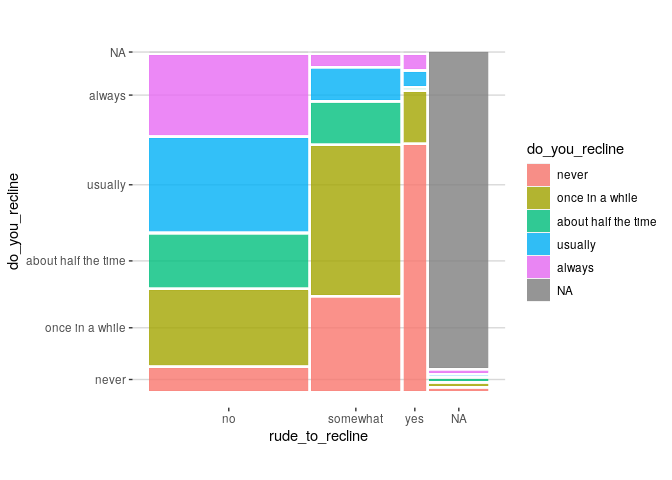

<!-- README.md is generated from README.Rmd. Please edit that file -->

[](https://cran.r-project.org/package=ggmosaic)
[](http://www.r-pkg.org/pkg/ggmosaic)
[](https://travis-ci.org/haleyjeppson/ggmosaic)

# ggmosaic

ggmosaic was designed to create visualizations of categorical data and
is capable of producing bar charts, stacked bar charts, mosaic plots,
and double decker plots.

## Installation

You can install ggmosaic from github with:

``` r
# install.packages("devtools")
devtools::install_github("haleyjeppson/ggmosaic")
```

## Example

``` r
library(ggmosaic)
#> Loading required package: ggplot2
ggplot(data = fly) +
  geom_mosaic(aes(x = product(rude_to_recline), fill=do_you_recline))
```

<!-- -->

## geom\_mosaic: setting the aesthetics

Aesthetics that can be set:

  - `weight`: select a weighting variable

  - `x`: select variables to add to formula
    
      - declared as `x = product(x1, x2, ...)`

  - `fill`: select a variable to be filled
    
      - if the variable is not also called in `x`, it will be added to
        the formula in the first position

  - `conds` : select a variable to condition on
    
      - declared as `conds = product(cond1, cond2, ...)`

These values are then sent through `productplots` functions to create
the formula for the desired distribution. The formula is constructed as:
`weight ~ fill + x | conds`
